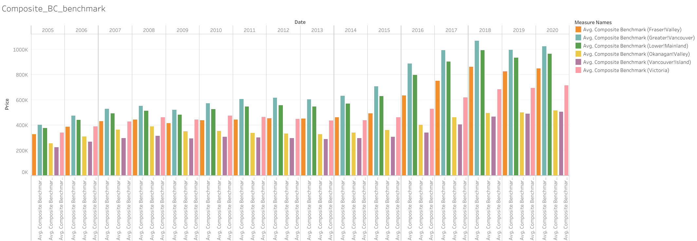

# Final-Project-Tableau

## Project/Goals
### 1. Show the trend of house price across Canada in the last 40 years
### 2. Compare the trend between house price and office price
### 3. Compare the trend between house price and yearly earning in Canada
### 4. Show the impact of economic crisis to housing price, earning and office price

## Process
### 1. Extracting data and convert into xlsx files
### 2. Creating data visualization on Tableau
### 3. Analyzing data by graphs and charts
### 4. Sharing the results

## Results
(Fill in which Option you chose, either 1 or 2. List the dataset you selected for the project if you selected Option 2. Also, discuss the visualizations you created, and why. For Option 2, also identify what your data question was, and how you went through the prompts.)
### I choose option 1
### 1. Show the trend of house prices across Canada in the last 40 years (table housing_price_index).

### I'm using line chart to show the trend of housing price index. As we can see in the chart above, housing price index in Canada is increasing gradually over the last 40 years

### 2. Compare the trend after 2005 with actual benchmark prices in table real_estate_prices to see if there are any differences.

### For this question, I'm using a histogram for the actual benchmark price and narrowing down my search with the average composite benchmark price to compare the housing trend with the actual benchmark. Moreover, I sort the house price by different provinces and also compare the house price between cities which have a high population in each province in the below histogram. In general, the housing price trend in every province is increasing for over the year after 2005. Moreover, some cities with high populations such as Vancouver and Toronto are increasing dramatically due to high demand. There was a wave of immigration from ASIA countries such as China, HongKong, India and Vietnam which leads to the overprice of house pricing 

### 3. Compare this trend with the trend of office prices. Which one is getting more expensive, faster?

### According to the histogram above, the housing price index and office price index are increasing over the last 40 years. Furthermore, as we can see from the end of the 90s to 2000 afterward, the office price index is increasing dramatically and left a large gap with the house price index because of the dot com bubble. As a result, office price is growing faster and more expensive

### 4 & 5. Create a heatmap of Canada with current house prices for each available district. Are the price differences between different districts increasing?

### Base on the heat map. The price is slightly different  between different districts over the course of the year

### 6. Compare the trend of house prices with earnings. *In case you want to plot monthly salary, be aware that the earnings value is per week.

### The growth of house prices and earnings increase differently in every province. However, in general, We can see that there is a large gap between the average composite house price and the average Canadian yearly income

### 7. Did people spend more of their earnings in 2014 than they did in 2001?

### Yes, people spent more of their earnings in 2014 than they did in 2001 because of the increase in the Consumer Price Index (CPI) which measures the percentage change in the price of a basket of goods and services consumed by households. The bank of Canada aims to keep inflation at the 2 percent midpoint of an inflation-control target range of 1 to 3 percent which means the price of goods and housing are going to rise every year. As a consequence, it also leads to an increase of CPI and people have to spend more of their earnings

### 8. There were several economic crisis in the world in the last 40 years, including these four: Black Monday (1987), Recession (early 1990s), dot com bubble (2000 - 2002), Financial crisis (2007 - 2009). Show the effect of these crises on: Earnings, House prices, Office prices, House constructions, Consumer index

### We can see that when the economic crisis happened, office prices tend to decrease slightly and held steady during Black Monday and the Recession while the consumer and house price index was increasing. However, there was a shift change between the office price and the other two when the economy recovered and boomed after 2000 thanks to the dot com bubble. When the financial crisis hit from 2007-2009, all of the indexes are decreasing dramatically. Moreover, the house construction value is also decreased because of the crisis

### 9. Plot consumer_index together with housing_price_index and fit the regression line between them. Can we predict consumer_index from the housing_price_index?

### In my opinion, there is a relationship between the consumer index and the housing price index. Furthermore, we can predict the consumer index from the housing price index and vice versa
## Future Goals
### If I had more time, I would read more about the real estate industry to have a better understanding of the data so I can have a better analyze
